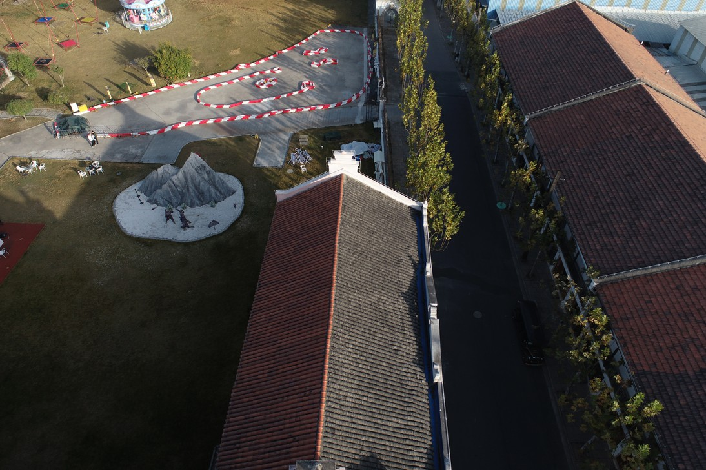
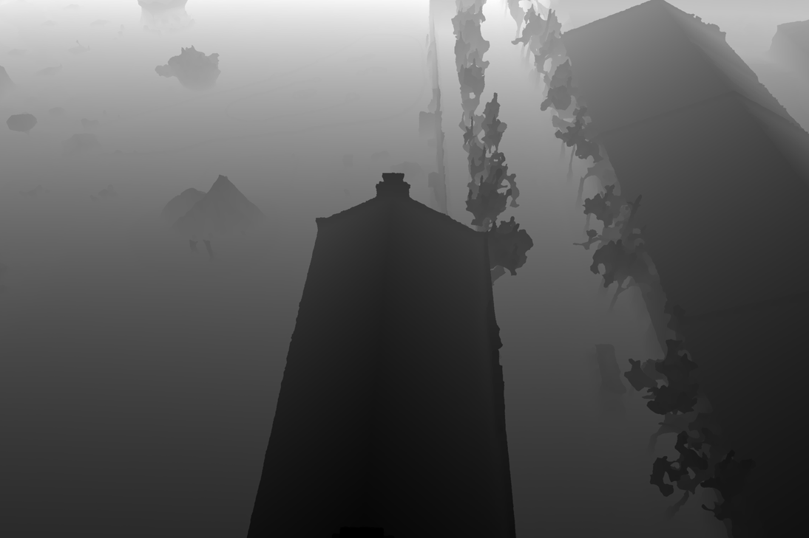
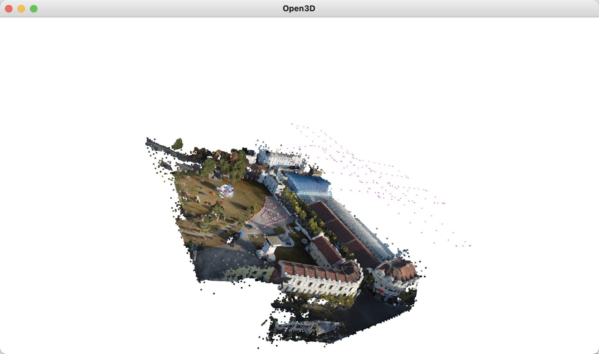

# Preprocessing NeRF Data

The structure of the data:

1. only images & images + tiepoints (in cc xml)
    ```
   ├── images 
   │   ├── img_1
   │   └── img_2
   ├── images_5 # downsample 5*
   │   ├── img_1
   │   └── img_1
   ├── xml
   └── json
   ```

2. images + las
    ```
   ├── images 
   │   ├── img_1
   │   └── img_2
   ├── images_5 # downsample 5*
   │   └── ...
   ├── LAS 
   │   └── las
   ├── xml
   └── json
   ```

3. images + depth

   + outdoor

     ```
     ├── images 
     │   ├── rgb
     │   │   ├── img_1
     │   │   ├── img_2
     │   └── depth
     │   │   ├── img_1
     │   │   ├── img_2
     ├── images_5 # downsample 5*
     │   ├── ...
     ├── xml
     └── json
     ```

   + indoor

     ```
     ├── images 
     │   ├── rgb
     │   │   ├── ARW
     │   │   ├── JPG
     │   │   │   ├── img_1
     │   │   │   ├── img_2
     │   └── depth
     │   │   ├── img_1
     │   │   ├── img_2
     ├── images_5 # downsample 5*
     │   ├── ...
     ├── xml
     └── json
     ```


## read_xml.py

from cc xml to a dict

```python
def read_xml(input_xml):
	...
	c2w = np.hstack([rot_mat[:3,:4], np.array([[height, width, focal_px]]).T])
	results[id] = {'path': path, 'rot_mat': c2w.tolist()}
```

## downsample.py

downsample image N* (output format: jpg)

```sh
python downsample.py --input_path wukang --input_xml wukang_9_qingxie.xml --downsample 4
```


## ccxml2json.py

convert cc xml to json for nerfstudio

```sh
python ccxml2json.py --input_path . --input_xml shizi.xml --output_transforms shizi.json
```

## visualize_depth.py

convert depth (.exr) to (.png). When using this script, you have first to check the channel of the exr image (`list_exr_channels` function). If the channel is Y, it means that the image is grayscale, and then you can use the `exr_to_jpg_greyscale` function. Here is an example (deyilou/project/outdoor/am/100_0004_0225):

<center class="half">     </center>

```python
def list_exr_channels(exr_file):
    exr = OpenEXR.InputFile(exr_file)
    channels = exr.header()['channels']
    print("Channels in the EXR file:")
    for channel in channels:
        print(channel)
```

## utils.py

orient_and_center_poses function: "pca", "up", "vertical", "none"


## visualize.py

Visualize camera pose & point clouds. Here is an example (deyilou/outdoor/am)

camera: Opencv coordinate

<center class="half">    </center>

